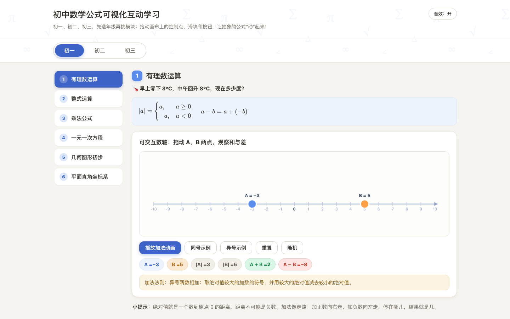
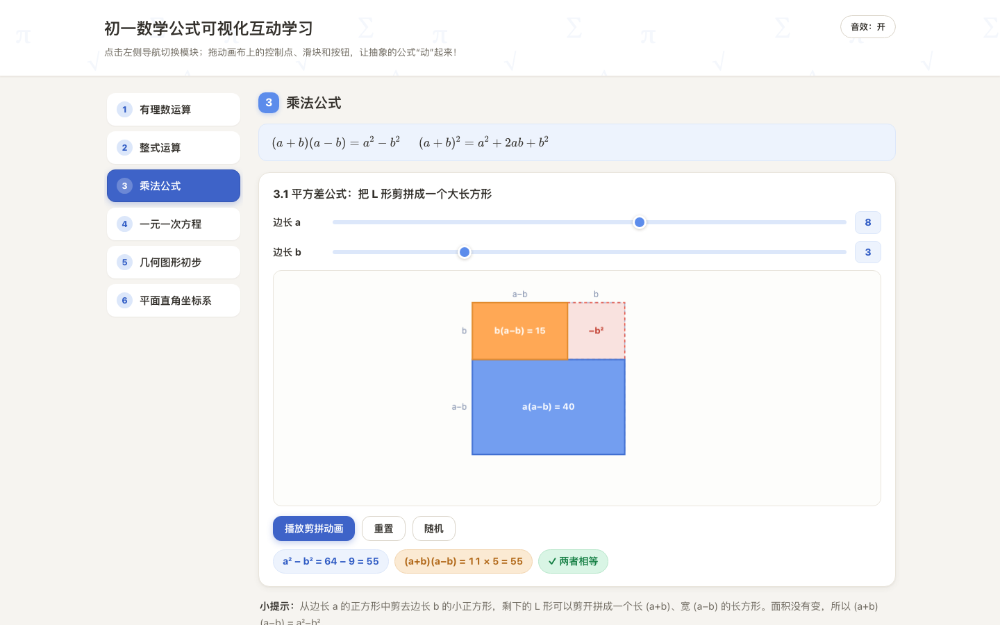
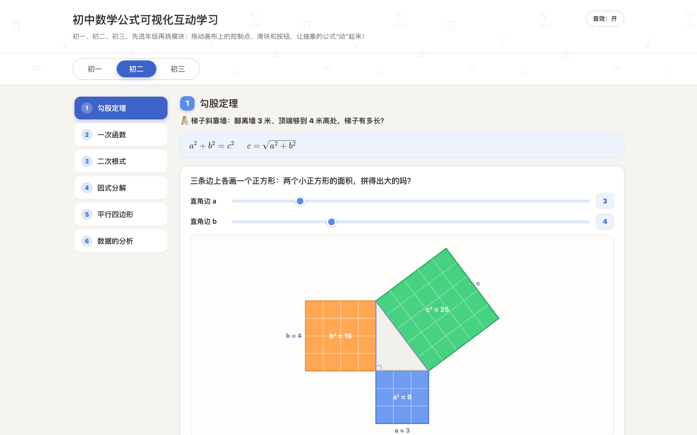
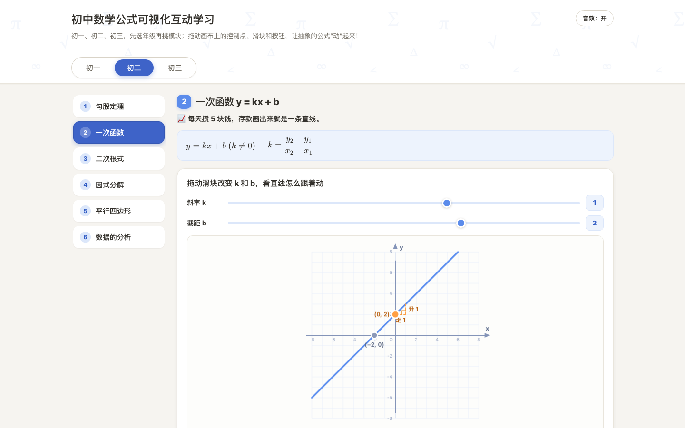
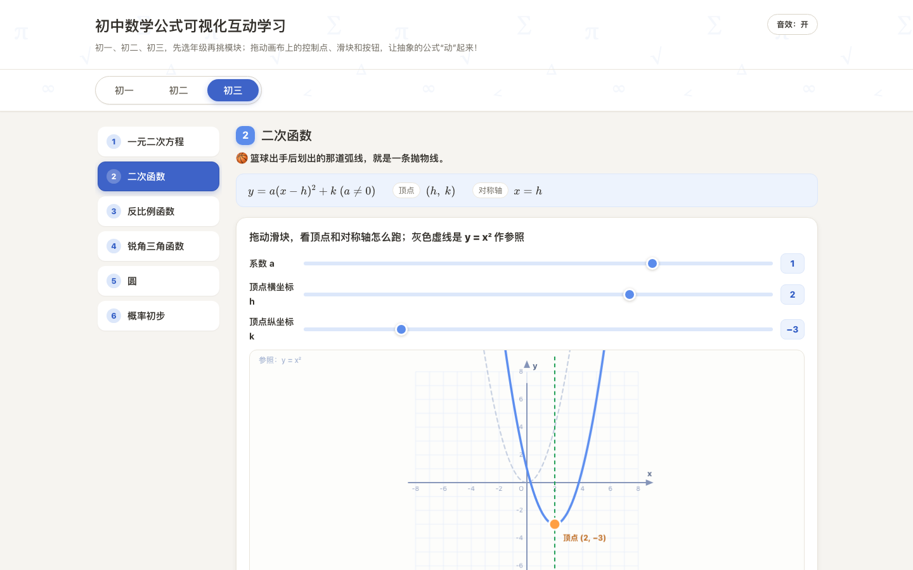
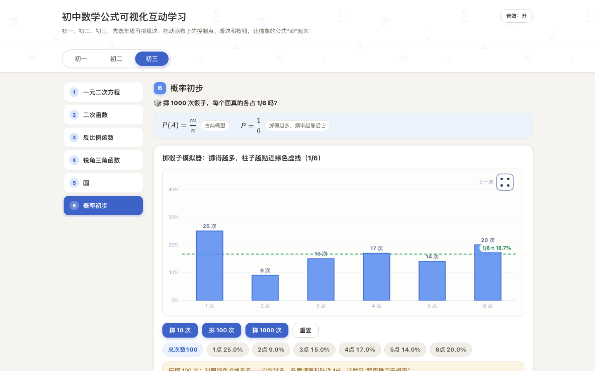

# 初中数学公式可视化互动学习

**中文** | [English](#english)



> 把初中三年的数学公式变成可以"动手玩"的互动实验：选年级、挑模块，拖一拖点一点，抽象公式立刻看得见。
> Turn three years of middle-school math formulas into hands-on interactive visualizations — pick a grade, drag, click, and watch abstract formulas come alive.

[在线体验 Live Demo](https://math.qiaomu.ai/) · [MIT License](LICENSE)

**已验证：** 线上 https://math.qiaomu.ai/ 返回 200，桌面与移动端零 console 报错，KaTeX 公式正常渲染。

## 这是什么

一个**单 HTML 文件**的初中数学互动学习网页，面向 12–15 岁的初中生（也适合家长陪学、老师课堂演示）。顶部按 **初一 / 初二 / 初三** 三个年级 Tab 切换，左侧导航选模块，共 **18 个互动模块**覆盖初中核心知识点：每个模块先用 KaTeX 渲染标准公式，配一句生活场景钩子（梯子靠墙、篮球抛物线、掷骰子……），再用 Canvas 可交互图形把公式"演"出来，最后配一段大白话讲解。

## 为什么值得用

- **零安装**：克隆后双击 `index.html` 就能用，也可以直接访问在线版
- **真交互**：不是看视频，是学生自己动手拖点、拖滑块、点按钮，实时看到数值变化
- **几何直观**：平方差、勾股定理、完全平方等用面积剪拼动画演示，理解而非死记
- **场景化讲解**：每个模块都从生活场景切入（奶茶评分、攒钱直线、抽卡概率），拒绝枯燥
- **单文件交付**：内嵌 CSS/JS，只有一个 KaTeX CDN 依赖，方便拷进任何课堂电脑

## 核心能力

### 初一（6 个模块）

| 模块 | 学生得到什么 |
|---|---|
| 有理数运算 | 可拖动双点数轴，实时显示绝对值/和/差，箭头动画演示同号/异号相加法则 |
| 整式运算（幂） | 方块堆叠合并动画演示 a^m × a^n = a^(m+n)，m/n 可调，附数值验证 |
| 乘法公式 | 平方差 L 形剪拼成长方形动画；完全平方四色块分割图，滑块实时改 a、b |
| 一元一次方程 | 天平平衡动画演示移项与化系数两步解法，滑块调 a/b/c 看解的变化 |
| 几何图形初步 | 可拖动的角（自动分类锐/直/钝/平角）、互余互补联动、线段中点验证 AM=MB |
| 平面直角坐标系 | 点击放置点 P，自动生成关于 x 轴/y 轴/原点的三个对称点，虚线展示对称关系 |



### 初二（6 个模块）

| 模块 | 学生得到什么 |
|---|---|
| 勾股定理 | 三边正方形面积可视化 + 方格数数验证 + 弦图割补证明动画 |
| 一次函数 | 滑块调 k、b 看直线变化，斜率三角形"走 1 升 k"，截距/交点实时标注 |
| 二次根式 | √a·√b=√(ab) 数值验证器 + 分步动画演示 √12=2√3 化简过程 |
| 因式分解 | 代数砖块拼矩形，滑块调 p、q 看 x²+(p+q)x+pq=(x+p)(x+q) 双向对应 |
| 平行四边形 | 拖动顶点变形，对边/对角/对角线性质实时验证，矩形/菱形/正方形 morph |
| 数据的分析 | 拖动柱子改数据，平均数/中位数/众数/极差/方差实时重算 |





### 初三（6 个模块）

| 模块 | 学生得到什么 |
|---|---|
| 一元二次方程 | 滑块调 a/b/c，抛物线与 x 轴交点联动，判别式 Δ 三种状态彩色区分 |
| 二次函数 | y=a(x−h)²+k 顶点式滑块演示，顶点/对称轴/开口方向实时高亮 |
| 反比例函数 | 双曲线 + 可拖动点 P，x·y=k 验证，矩形面积=\|k\| 可视化 |
| 锐角三角函数 | 拖角改 θ，sin/cos/tan 实时数值，30°/45°/60° 特殊角一键精确值 |
| 圆 | 圆周角定理拖动验证（∠APB 恒等于圆心角一半）+ 弧长扇形面积计算 |
| 概率初步 | 掷骰子模拟器，频率柱状图随次数增加收敛到 1/6 |





## 快速开始

### 最快路径

直接用浏览器打开在线版：<https://math.qiaomu.ai/>

或本地运行（无需任何构建）：

```bash
git clone https://github.com/joeseesun/mathlearn.git
cd mathlearn
open index.html        # macOS；Windows 双击 index.html 即可
```

<details>
<summary>用本地静态服务器运行（可选）</summary>

```bash
python3 -m http.server 8000
# 打开 http://localhost:8000
```

</details>

## 交互设计

- 年级 Tab 切换 + 每年级 6 个模块，URL hash 支持深链（如 `#g2-1` 直达初二勾股定理）
- 每个可视化区域配「重置」和「随机生成」按钮
- 关键数值变化有过渡动画；拖动/按钮操作有 WebAudio 程序化音效（可静音）
- 统一使用 Pointer Events，鼠标与触摸（平板/手机）均可拖动
- 响应式：窄屏时左侧导航自动变为顶部横向滚动条
- 支持 `prefers-reduced-motion`，键盘 `:focus-visible` 有焦点环

## 技术栈

- 单文件 `index.html`（内嵌 CSS + JavaScript，约 4300 行，含中文注释）
- [KaTeX](https://katex.org/) 0.16（jsdelivr CDN）公式渲染，加载失败自动回退 Unicode 文本公式
- Canvas 2D 全部可视化（数轴/方块/几何图/天平/函数图像/圆/统计图），未引入重型 3D 库
- WebAudio API 程序化音效，无外部音频文件

## 实测验证

- 内联 JS 通过 `node --check` 语法检查
- Playwright 无头浏览器实测：18 个模块点击/拖动/动画播放全部正常，console 零报错
- 桌面 1440px 与移动 390/480px 截图验证，无横向滚动、无控件挤压
- 线上 <https://math.qiaomu.ai/> 返回 200，Umami 统计脚本正常加载

## 限制与边界

- 内容为初中核心知识点精选，非教材全覆盖（如全等三角形证明、相似三角形未做成交互）
- 部分演示为教学做了约束：初一方程模块 c ≥ b（解非负）；三角函数斜边固定为 5
- KaTeX 依赖 CDN，完全离线环境下公式会回退为 Unicode 文本
- 在线版含 [Umami](https://umami.qiaomu.ai/) 隐私友好访问统计（仅 math.qiaomu.ai 域名生效），本地打开不会上报

## 关于向阳乔木

- 网站：[qiaomu.ai](https://qiaomu.ai/) · 博客：[blog.qiaomu.ai](https://blog.qiaomu.ai/) · 好物推荐：[tuijian.qiaomu.ai](https://tuijian.qiaomu.ai/)
- X：[@vista8](https://x.com/vista8) · GitHub：[@joeseesun](https://github.com/joeseesun)
- 微信公众号：向阳乔木推荐看

## License

[MIT](LICENSE) © 向阳乔木

---

<a name="english"></a>

# Middle-School Math Formula Visualizer

A **single-HTML-file** interactive learning page that turns three years of middle-school math (Grades 7–9, ages 12–15) into hands-on visual experiments. Grade tabs （初一/初二/初三） + sidebar navigation, **18 interactive modules**: rational numbers, exponents, multiplication formulas, linear equations, basic geometry, the Cartesian plane, the Pythagorean theorem, linear functions, radicals, factoring, parallelograms, statistics, quadratic equations & functions, inverse proportions, trigonometry, circles, and probability.

**Try it live:** <https://math.qiaomu.ai/> — or clone and double-click `index.html`. No build step; the only external dependency is the KaTeX CDN (with an automatic Unicode fallback when offline).

**Highlights**

- Every module: KaTeX-rendered formula + a real-life hook (ladders, basketball arcs, dice) + Canvas interaction + plain-language explanation
- Geometric proofs you can play with: cut-and-paste area animations for (a+b)(a−b) and a²+b²=c², algebra tiles for factoring
- Sliders & draggable points everywhere, with live numeric feedback, colored state chips, and reset/random buttons
- Touch support (Pointer Events), responsive layout, programmatic WebAudio sounds with mute, `prefers-reduced-motion` support, hash deep links (`#g2-1`)

**Stack:** single `index.html` (~4300 lines, commented in Chinese), KaTeX via CDN, Canvas 2D for all visualizations, WebAudio for sound.

**Verified:** Playwright smoke tests across all 18 modules with zero console errors on desktop 1440px and mobile 390/480px; live site returns 200.

**Limits:** a curated subset of the curriculum; some demos are constrained for teaching (e.g. Grade-7 equation module keeps c ≥ b); the hosted page includes privacy-friendly Umami analytics (math.qiaomu.ai only).

Maintained by 向阳乔木 ([@joeseesun](https://github.com/joeseesun)) · [MIT License](LICENSE)
