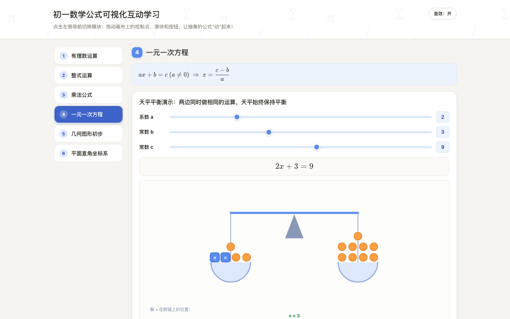
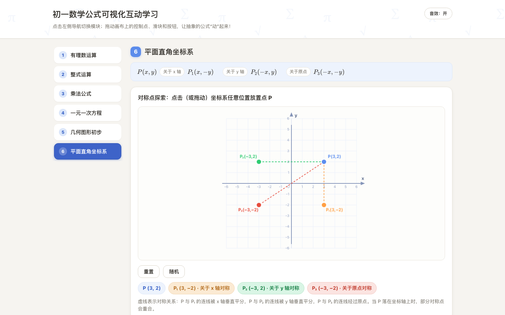

# 初一数学公式可视化互动学习

**中文** | [English](#english)


> 把初一数学公式变成可以"动手玩"的互动实验：拖一拖、点一点，抽象公式立刻看得见。
> Turn Grade-7 math formulas into hands-on interactive visualizations — drag, click, and watch abstract formulas come alive.

[在线体验 Live Demo](https://math.qiaomu.ai/) · [MIT License](LICENSE)

**已验证：** 线上 https://math.qiaomu.ai/ 返回 200，桌面与移动端零 console 报错，KaTeX 公式正常渲染。

## 这是什么

一个**单 HTML 文件**的初一数学互动学习网页，面向 12–13 岁的初中一年级学生（也适合家长陪学、老师课堂演示）。左侧导航 + 右侧内容区，6 个模块覆盖初一上学期核心知识点：每个模块先用 KaTeX 渲染标准公式，再用 Canvas 可交互图形把公式"演"出来，配一段不超过 3 句话的大白话讲解。

## 为什么值得用

- **零安装**：克隆后双击 `index.html` 就能用，也可以直接访问在线版
- **真交互**：不是看视频，是学生自己动手拖点、拖滑块、点按钮，实时看到数值变化
- **几何直观**：平方差、完全平方等公式用面积剪拼动画演示，理解而非死记
- **单文件交付**：内嵌 CSS/JS，只有一个 KaTeX CDN 依赖，方便拷进任何课堂电脑

## 核心能力

| 模块 | 学生得到什么 |
|---|---|
| 1. 有理数运算 | 可拖动双点数轴，实时显示绝对值/和/差，箭头动画演示同号/异号相加法则 |
| 2. 整式运算（幂） | 方块堆叠合并动画演示 a^m × a^n = a^(m+n)，m/n 可调，附数值验证 |
| 3. 乘法公式 | 平方差 L 形剪拼成长方形动画；完全平方四色块分割图，滑块实时改 a、b |
| 4. 一元一次方程 | 天平平衡动画演示移项与化系数两步解法，滑块调 a/b/c 看解的变化 |
| 5. 几何图形初步 | 可拖动的角（自动分类锐/直/钝/平角）、互余互补联动、线段中点验证 AM=MB |
| 6. 平面直角坐标系 | 点击放置点 P，自动生成关于 x 轴/y 轴/原点的三个对称点，虚线展示对称关系 |






## 快速开始

### 最快路径

直接用浏览器打开在线版：<https://math.qiaomu.ai/>

或本地运行（无需任何构建）：

```bash
git clone https://github.com/joeseesun/mathlearn.git
cd mathlearn
open index.html        # macOS；Windows 双击 index.html 即可
```

<details>
<summary>用本地静态服务器运行（可选）</summary>

```bash
python3 -m http.server 8000
# 打开 http://localhost:8000
```

</details>

## 交互设计

- 每个可视化区域配「重置」和「随机生成」按钮
- 关键数值变化有过渡动画；拖动/按钮操作有 WebAudio 程序化音效（可静音）
- 统一使用 Pointer Events，鼠标与触摸（平板/手机）均可拖动
- 响应式：窄屏时左侧导航自动变为顶部横向滚动条
- 支持 `prefers-reduced-motion`，键盘 `:focus-visible` 有焦点环

## 技术栈

- 单文件 `index.html`（内嵌 CSS + JavaScript，约 2000 行，含中文注释）
- [KaTeX](https://katex.org/) 0.16（jsdelivr CDN）公式渲染，加载失败自动回退 Unicode 文本公式
- Canvas 2D 全部可视化（数轴/方块/几何图/天平/角/坐标系），未引入重型 3D 库
- WebAudio API 程序化音效，无外部音频文件

## 实测验证

- 内联 JS 通过 `node --check` 语法检查
- Playwright 无头浏览器实测：6 个模块点击/拖动/动画播放全部正常，console 零报错
- 桌面 1440px 与移动 390px 截图验证，无横向滚动、无控件挤压
- 线上 <https://math.qiaomu.ai/> 返回 200，Umami 统计脚本正常加载

## 限制与边界

- 内容为初一上学期范围，不含负数常数项方程等进阶情形（模块 4 为演示约束 c ≥ b）
- 角度演示范围为 1°–180°；点 P 落在坐标轴上时部分对称点会重合（页面内有说明）
- KaTeX 依赖 CDN，完全离线环境下公式会回退为 Unicode 文本
- 在线版含 [Umami](https://umami.qiaomu.ai/) 隐私友好访问统计（仅 math.qiaomu.ai 域名生效），本地打开不会上报

## 关于向阳乔木

- 网站：[qiaomu.ai](https://qiaomu.ai/) · 博客：[blog.qiaomu.ai](https://blog.qiaomu.ai/) · 好物推荐：[tuijian.qiaomu.ai](https://tuijian.qiaomu.ai/)
- X：[@vista8](https://x.com/vista8) · GitHub：[@joeseesun](https://github.com/joeseesun)
- 微信公众号：向阳乔木推荐看

## License

[MIT](LICENSE) © 向阳乔木

---

<a name="english"></a>

# Grade-7 Math Formula Visualizer

A **single-HTML-file** interactive learning page that turns Grade-7 (age 12–13) math formulas into hands-on visual experiments. Left nav + content area, 6 modules covering rational numbers, exponents, multiplication formulas (difference of squares & perfect square), linear equations, basic geometry (angles & midpoints), and the Cartesian plane.

**Try it live:** <https://math.qiaomu.ai/> — or clone and double-click `index.html`. No build step; the only external dependency is the KaTeX CDN (with an automatic Unicode fallback when offline).

**Highlights**

- Draggable number line with animated addition arrows; block-merge animation for a^m × a^n = a^(m+n)
- Geometric cut-and-paste animation for (a+b)(a−b) = a²−b²; four-region area proof of (a+b)² = a²+2ab+b² with sliders
- Balance-scale animation solving ax+b=c step by step (transpose, then divide)
- Draggable angle with acute/right/obtuse classification, complementary/supplementary linkage, midpoint verification
- Click-to-place point P with auto-generated reflections across the x-axis, y-axis, and origin
- Touch support (Pointer Events), responsive layout, programmatic WebAudio sounds with mute, `prefers-reduced-motion` support

**Stack:** single `index.html` (~2000 lines, commented in Chinese), KaTeX via CDN, Canvas 2D for all visualizations, WebAudio for sound.

**Verified:** Playwright smoke tests across all 6 modules with zero console errors on desktop 1440px and mobile 390px; live site returns 200.

**Limits:** content targets first-semester Grade-7 scope; module 4 constrains c ≥ b for non-negative solutions; the hosted page includes privacy-friendly Umami analytics (math.qiaomu.ai only).

Maintained by 向阳乔木 ([@joeseesun](https://github.com/joeseesun)) · [MIT License](LICENSE)
